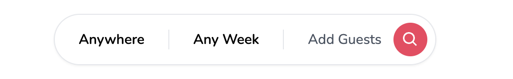
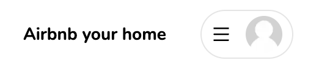
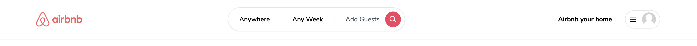

## Section 1: Folder Structure

### 1. Define a folder structure

- create a folder using Nextjs without src and app folder

```bash
npx create-next-app --typescript
```

import { Nunito } from "next/font/google";

- add `Nunito` font to the project using[layout](/app/layout.tsx)

```tsx
import { Nunito } from "next/font/google";
import "./globals.css";

export const metadata = {
  title: "Airbnb Clone",
  description: "Airbnb Clone built with Next.js",
};

const font = Nunito({
  subsets: ["latin"],
});
export default function RootLayout({
  children,
}: {
  children: React.ReactNode;
}) {
  return (
    <html lang="en">
      <body className={font.className}>{children}</body>
    </html>
  );
}
```

### 2. install tailwind css

- install [Tailwind CSS](https://tailwindcss.com/docs/guides/nextjs)

```js
npm install -D tailwindcss postcss autoprefixer
npx tailwindcss init -p
```

- Configure your template paths

```js
/** @type {import('tailwindcss').Config} */
module.exports = {
  content: [
    "./app/**/*.{js,ts,jsx,tsx}",
    "./pages/**/*.{js,ts,jsx,tsx}",
    "./components/**/*.{js,ts,jsx,tsx}",

    // Or if using `src` directory:
    "./src/**/*.{js,ts,jsx,tsx}",
  ],
  theme: {
    extend: {},
  },
  plugins: [],
};
```

- Add global style in [globals.css](/styles/globals.css)

```css
@tailwind base;
@tailwind components;
@tailwind utilities;
```

## Section 2: Navbar UI

### 3. Navbar

- Update global style in [globals.css](/styles/globals.css)

```css
@tailwind base;
@tailwind components;
@tailwind utilities;

html,
body,
:root {
  height: 100%;
}

.leaflet-bottom,
.leaflet-control,
.leaflet-pane,
.leaflet-top {
  z-index: 0 !important;
}

.rdrMonth {
  width: 100% !important;
}

.rdrCalendarWrapper {
  font-size: 16px !important;
  width: 100% !important;
}
```

- install [react-icons](/https://react-icons.github.io/react-icons/)

```bash
$ npm i react-icons
```

- create [Avatar](/app/components/Avatar.tsx)
  

```tsx
"use client";

import Image from "next/image";

interface AvatarProps {
  src: string | null | undefined;
}

const Avatar = ({ src }: AvatarProps) => {
  return (
    <Image
      className="rounded-full"
      height="30"
      width="30"
      alt="Avatar"
      src={src || "/images/placeholder.jpg"}
    />
  );
};

export default Avatar;
```

- [Logo](/app/components/navbar/Logo.tsx)
  

```tsx
"use client";

import Image from "next/image";
import { useRouter } from "next/navigation";

const Logo = () => {
  const router = useRouter();
  return (
    <Image
      height="100"
      width="100"
      alt="logo"
      className="hidden md:block cursor-pointer"
      src="/images/logo.png"
    />
  );
};

export default Logo;
```

- create [Search](/app/components/navbar/Search.tsx)
  

```tsx
"use client";

import { BiSearch } from "react-icons/bi";

const Search = () => {
  return (
    <div className="border-[1px] w-full md:w-auto py-2 rounded-full shadow-sm hover:shadow-sm transition cursor-pointer">
      <div className="flex flex-row justify-between items-center">
        <div className=" text-black text-sm font-semibold px-6">Anywhere</div>
        <div className="hidden sm:block text-sm font-semibold px-6 border-x-[1px]  flex-1 flex-center">
          Any Week
        </div>
        <div className="text-sm pl-6 pr-2 text-gray-600 flex flex-row items-center gap-3">
          <div className="hidden sm:block">Add Guests</div>
          <div
            className="
              p-2 
              bg-rose-500 
              rounded-full 
              text-white
            "
          >
            <BiSearch size={18} />
          </div>
        </div>
      </div>
    </div>
  );
};

export default Search;
```

- create [MenuItem](/app/components/navbar/UserMenu.tsx)
  

```tsx
"use client";

interface MenuItemProps {
  onClick: () => void;
  label: string;
}

const MenuItem = ({ onClick, label }: MenuItemProps) => {
  return (
    <div
      onClick={onClick}
      className="
        px-4 
        py-3 
        hover:bg-neutral-100 
        transition
        font-semibold
      "
    >
      {label}
    </div>
  );
};

export default MenuItem;
```

- [userMenu](/app/components/navbar/UserMenu.tsx)
  

```tsx
"use client";

import { AiOutlineMenu } from "react-icons/ai";
import Avatar from "../Avatar";
import { useCallback, useState } from "react";
import MenuItem from "./MenuItem";

const UserMenu = () => {
  const [isOpen, setIsOpen] = useState(false);

  const toggleOpen = useCallback(() => {
    setIsOpen((prev) => !prev);
  }, []);

  return (
    <div className="relative">
      <div className="flex flex-row items-center gap-3">
        <div
          className="hidden md:block text-sm font-bold py-3 px-4 rounded-full hover:bg-neutral-100 transition cursor-pointer"
          onClick={() => {}}
        >
          Airbnb your home
        </div>
        <div
          className="p-4 transition md:py-1 flex flex-row items-center gap-3 rounded-full cursor-pointer hover:shadow-md md:px-2 border-[1px] border-neutral-200 "
          onClick={toggleOpen}
        >
          <AiOutlineMenu />
          <div className="hidden md:block">
            <Avatar />
          </div>
        </div>
      </div>
      {isOpen && (
        <div
          className="
           absolute 
           rounded-xl 
           shadow-md
           w-[40vw]
           md:w-3/4 
           bg-white 
           overflow-hidden 
           right-0 
           top-12 
           text-sm
         "
        >
          <div className="flex flex-col cursor-pointer">
            <>
              <MenuItem onClick={() => {}} label="Login" />
              <MenuItem onClick={() => {}} label="Sign up" />
            </>
          </div>
        </div>
      )}
    </div>
  );
};

export default UserMenu;
```

- create [Navbar](/app/components/navbar/Navbar.tsx)
  

```tsx
"use client";
import Container from "../Container";
import Logo from "./Logo";
import Search from "./Search";
import UserMenu from "./UserMenu";

const Navbar = () => {
  return (
    <div className="fixed bg-white z-10 shadow-sm w-full">
      <div className="py-4 border-b-[1px]">
        <Container>
          <div className="flex gap:3 md:gap-0 flex-row justify-between items-center">
            <Logo />
            <Search />
            <UserMenu />
          </div>
        </Container>
      </div>
    </div>
  );
};

export default Navbar;
```

## Section 3: Auth UI

### 4. Prevent Navbar from Hydration

- create [ClientOnly](/app/components/ClientOnly.tsx) && [layout](/app/layout.tsx) to prevent navbar from Hydration error.

```tsx
"use client";

import { useEffect, useState } from "react";

interface clientOnlyProps {
  children: React.ReactNode;
}
const ClientOnly = ({ children }: clientOnlyProps) => {
  const [hasMounted, setHasMounted] = useState(false);

  useEffect(() => {
    setHasMounted(true);
  }, []);

  if (!hasMounted) return null;
  return <>{children}</>;
};

export default ClientOnly;
```

### 5. Modal

- create [](app/components/modals/modal.tsx) && [layout](/app/layout.tsx)

```tsx
"use client";

import { useCallback, useEffect, useState } from "react";
import { IoMdClose } from "react-icons/io";

import Button from "../Button";

interface ModalProps {
  isOpen?: boolean;
  onClose: () => void;
  onSubmit: () => void;
  title?: string;
  body?: React.ReactElement;
  footer?: React.ReactElement;
  actionLabel: string;
  disabled?: boolean;
  secondaryAction?: () => void;
  secondaryActionLabel?: string;
}

const Modal = ({
  isOpen,
  onClose,
  onSubmit,
  title,
  body,
  actionLabel,
  footer,
  disabled,
  secondaryAction,
  secondaryActionLabel,
}: ModalProps) => {
  const [showModal, setShowModal] = useState(isOpen);

  useEffect(() => {
    setShowModal(isOpen);
  }, [isOpen]);

  const handleClose = useCallback(() => {
    if (disabled) {
      return;
    }

    setShowModal(false);
    setTimeout(() => {
      onClose();
    }, 300);
  }, [onClose, disabled]);

  const handleSubmit = useCallback(() => {
    if (disabled) {
      return;
    }

    onSubmit();
  }, [onSubmit, disabled]);

  const handleSecondaryAction = useCallback(() => {
    if (disabled || !secondaryAction) {
      return;
    }

    secondaryAction();
  }, [secondaryAction, disabled]);

  if (!isOpen) {
    return null;
  }

  return (
    <>
      <div className="fixed inset-0 z-50 flex items-center justify-center overflow-x-hidden overflow-y-auto outline-none focus:outline-none bg-neutral-800/70">
        <div className="relative w-full h-full mx-auto my-6 md:w-4/6 lg:w-3/6 xl:w-2/5 lg:h-auto md:h-auto">
          {/*content*/}
          <div
            className={`
            translate
            duration-300
            h-full
            ${showModal ? "translate-y-0" : "translate-y-full"}
            ${showModal ? "opacity-100" : "opacity-0"}
          `}
          >
            <div className="relative flex flex-col w-full h-full bg-white border-0 rounded-lg shadow-lg outline-none translate lg:h-auto md:h-auto focus:outline-none">
              {/*header*/}
              <div
                className="
                flex 
                items-center 
                p-6
                rounded-t
                justify-center
                relative
                border-b-[1px]
                "
              >
                <button
                  className="absolute p-1 transition border-0 hover:opacity-70 left-9"
                  onClick={handleClose}
                >
                  <IoMdClose size={18} />
                </button>
                <div className="text-lg font-semibold">{title}</div>
              </div>
              {/*body*/}
              <div className="relative flex-auto p-6">{body}</div>
              {/*footer*/}
              <div className="flex flex-col gap-2 p-6">
                <div className="flex flex-row items-center w-full gap-4 ">
                  {secondaryAction && secondaryActionLabel && (
                    <Button
                      disabled={disabled}
                      label={secondaryActionLabel}
                      onClick={handleSecondaryAction}
                      outline
                    />
                  )}
                  <Button
                    disabled={disabled}
                    label={actionLabel}
                    onClick={handleSubmit}
                  />
                </div>
                {footer}
              </div>
            </div>
          </div>
        </div>
      </div>
    </>
  );
};

export default Modal;
```

- create [Button](/app/components/Button.tsx)

```tsx
"use client";

import { IconType } from "react-icons";

interface ButtonProps {
  label: string;
  onClick: (e: React.MouseEvent<HTMLButtonElement>) => void;
  disabled?: boolean;
  outline?: boolean;
  small?: boolean;
  icon?: IconType;
}

const Button = ({
  label,
  onClick,
  disabled,
  outline,
  small,
  icon: Icon,
}: ButtonProps) => {
  return (
    <button
      disabled={disabled}
      onClick={onClick}
      className={`
        relative
        disabled:opacity-70
        disabled:cursor-not-allowed
        rounded-lg
        hover:opacity-80
        transition
        w-full
        ${outline ? "bg-white" : "bg-rose-500"}
        ${outline ? "border-black" : "border-rose-500"}
        ${outline ? "text-black" : "text-white"}
        ${small ? "text-sm" : "text-md"}
        ${small ? "py-1" : "py-3"}
        ${small ? "font-light" : "font-semibold"}
        ${small ? "border-[1px]" : "border-2"}
      `}
    >
      {Icon && <Icon size={24} className="absolute  left-4 top-3" />}
      {label}
    </button>
  );
};

export default Button;
```

### 6. Register Modal

- install zustand

```bash
$ npm i zustand
$ npm i axios
$ npm i react-hook-form
$ npm i react-hot-toast
```

- create a [useRegisterModal](/app/hooks/useRegisterModal.tsx) && [RegisterModal](app/components/modals/RegisterModal.tsx)

```ts
import { create } from "zustand";

interface registerModalStore {
  isOpen: boolean;
  onOpen: () => void;
  onClose: () => void;
}

const useRegisterModal = create<registerModalStore>((set) => ({
  isOpen: false,
  onOpen: () => set({ isOpen: true }),
  onClose: () => set({ isOpen: false }),
}));

export default useRegisterModal;
```

- create [RegisterModal](/app/components/modals/RegisterModal.tsx)

```tsx
"use client";

import { AiFillGithub } from "react-icons/ai";
// import { signIn } from "next-auth/react";
import { FcGoogle } from "react-icons/fc";
import { useCallback, useState } from "react";
import useRegisterModal from "@/app/hooks/useRegisterModal";
import { toast } from "react-hot-toast";
import { FieldValues, SubmitHandler, useForm } from "react-hook-form";
import axios from "axios";
import Modal from "./modal";
import Heading from "../Heading";
import Input from "../inputs/Input";

const RegisterModal = () => {
  const registerModal = useRegisterModal();
  const [isLoading, setIsLoading] = useState(false);

  const {
    register,
    handleSubmit,
    formState: { errors },
  } = useForm<FieldValues>({
    defaultValues: {
      name: "",
      email: "",
      password: "",
    },
  });

  const onSubmit: SubmitHandler<FieldValues> = useCallback((data) => {
    setIsLoading(true);

    axios
      .post("/api/register", data)
      .then(() => {
        registerModal.onClose();
      })
      .catch((error) => {
        console.log(error);
      })
      .finally(() => {
        setIsLoading(false);
      });
  }, []); //data is FieldValues, we send data to server and handle response error

  const bodyContent = (
    <div className="flex flex-col gap-4">
      <Heading title="Welcome to Airbnb" subtitle="Create an account!" />
      <Input
        id="email"
        label="Email"
        disabled={isLoading}
        register={register}
        errors={errors}
        required
      />
      <Input
        id="name"
        label="Name"
        disabled={isLoading}
        register={register}
        errors={errors}
        required
      />
      <Input
        id="password"
        label="Password"
        type="password"
        disabled={isLoading}
        register={register}
        errors={errors}
        required
      />
    </div>
  );

  return (
    <Modal
      disabled={isLoading}
      isOpen={registerModal.isOpen}
      title="Register"
      actionLabel="Continue"
      onClose={registerModal.onClose}
      onSubmit={handleSubmit(onSubmit)} //handleSubmit to wrap onSubmit function
      body={bodyContent}
    />
  );
};

export default RegisterModal;
```

- add [onOpen](/) && [UserMenu](/app/components/navbar/UserMenu.tsx)

```tsx
<MenuItem onClick={registerModal.onOpen} label="Sign up" />
```

- create [Heading](/app/components/Heading.tsx)

```tsx
"use client";

interface HeadingProps {
  title: string;
  subtitle?: string;
  center?: boolean;
}

const Heading = ({ title, subtitle, center }: HeadingProps) => {
  return (
    <div className={center ? "text-center" : "text-start"}>
      <div className="text-2xl font-bold">{title}</div>
      <div className="font-light text-neutral-500 mt-2">{subtitle}</div>
    </div>
  );
};

export default Heading;
```

- create [Input](/app/components/inputs/Input.tsx)

```tsx
"use client";

import { FieldErrors, FieldValues, UseFormRegister } from "react-hook-form";
import { BiDollar } from "react-icons/bi";

interface InputProps {
  id: string;
  label: string;
  type?: string;
  disabled?: boolean;
  formatPrice?: boolean;
  required?: boolean;
  register: UseFormRegister<FieldValues>; //we need it's in our form
  errors: FieldErrors;
}

const Input = ({
  id,
  label,
  type = "text",
  disabled,
  formatPrice,
  register,
  required,
  errors,
}: InputProps) => {
  return (
    <div className="relative w-full">
      {formatPrice && (
        <BiDollar
          size={24}
          className="absolute text-neutral-700 top-5 left-2"
        />
      )}
      <input
        id={id}
        disabled={disabled}
        {...register(id, { required })}
        placeholder=" "
        type={type}
        className={`
          peer
          w-full
          p-4
          pt-6 
          font-light 
          bg-white 
          border-2
          rounded-md
          outline-none
          transition
          disabled:opacity-70
          disabled:cursor-not-allowed
          ${formatPrice ? "pl-9" : "pl-4"}
          ${errors[id] ? "border-rose-500" : "border-neutral-300"}
          ${errors[id] ? "focus:border-rose-500" : "focus:border-black"}
        `}
      />
      <label
        className={`
          absolute 
          text-md
          duration-150 
          transform 
          -translate-y-3 
          top-5 
          z-10 
          origin-[0] 
          ${formatPrice ? "left-9" : "left-4"}
          peer-placeholder-shown:scale-100 
          peer-placeholder-shown:translate-y-0 
          peer-focus:scale-75
          peer-focus:-translate-y-4
          ${errors[id] ? "text-rose-500" : "text-zinc-400"}
        `}
      >
        {label}
      </label>
    </div>
  );
};

export default Input;
```

### 7. Toast Providers

- create [ToasterProvider](/app/providers/ToasterProvider.tsx) && [layout](/app/layout.tsx)

```ts
"use client";

import { Toaster } from "react-hot-toast";

const ToasterProvider = () => {
  return <Toaster />;
};

export default ToasterProvider;
```

- create [ModalsProvider](/app/providers/ModalsProvider.tsx)

```ts
"use client";

import RegisterModal from "../components/modals/RegisterModal";

const ModalsProvider = () => {
  return (
    <>
      <RegisterModal />
    </>
  );
};

export default ModalsProvider;
```

### 8.

### 9.

### 10.

### 11.

### 12.

### 13.

### 14.

### 15.

### 16.

## Section 4:

## Section 5:

## Section 6:

## Section 7:

## Section 8:

## Section 9:

## Section 10:

### 8.

### 9.

### 10.

### 11.

### 12.

### 13.

## External

- [react-hook-form](https://www.npmjs.com/package/react-hook-form)
- [axios](https://www.npmjs.com/package/axios)
- [zustand](https://www.npmjs.com/package/zustand)
- [react-hot-toast](https://www.npmjs.com/package/react-hot-toast)
- []()
- []()
