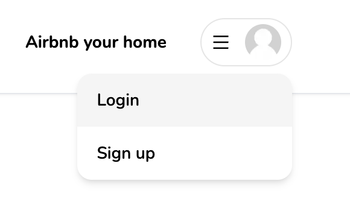

## Section 1: Folder Structure

### 1. Define a folder structure

- create a folder using Nextjs without src and app folder

```bash
npx create-next-app --typescript
```

import { Nunito } from "next/font/google";

- add `Nunito` font to the project using[layout](/app/layout.tsx)

```tsx
import { Nunito } from "next/font/google";
import "./globals.css";

export const metadata = {
  title: "Airbnb Clone",
  description: "Airbnb Clone built with Next.js",
};

const font = Nunito({
  subsets: ["latin"],
});
export default function RootLayout({
  children,
}: {
  children: React.ReactNode;
}) {
  return (
    <html lang="en">
      <body className={font.className}>{children}</body>
    </html>
  );
}
```

### 2. install tailwind css

- install [Tailwind CSS](https://tailwindcss.com/docs/guides/nextjs)

```js
npm install -D tailwindcss postcss autoprefixer
npx tailwindcss init -p
```

- Configure your template paths

```js
/** @type {import('tailwindcss').Config} */
module.exports = {
  content: [
    "./app/**/*.{js,ts,jsx,tsx}",
    "./pages/**/*.{js,ts,jsx,tsx}",
    "./components/**/*.{js,ts,jsx,tsx}",

    // Or if using `src` directory:
    "./src/**/*.{js,ts,jsx,tsx}",
  ],
  theme: {
    extend: {},
  },
  plugins: [],
};
```

- Add global style in [globals.css](/styles/globals.css)

```css
@tailwind base;
@tailwind components;
@tailwind utilities;
```

## Section 2: Navbar UI

### 3. Navbar

- Update global style in [globals.css](/styles/globals.css)

```css
@tailwind base;
@tailwind components;
@tailwind utilities;

html,
body,
:root {
  height: 100%;
}

.leaflet-bottom,
.leaflet-control,
.leaflet-pane,
.leaflet-top {
  z-index: 0 !important;
}

.rdrMonth {
  width: 100% !important;
}

.rdrCalendarWrapper {
  font-size: 16px !important;
  width: 100% !important;
}
```

- install [react-icons](/https://react-icons.github.io/react-icons/)

```bash
$ npm i react-icons
```

- create [Avatar](/app/components/Avatar.tsx)
  

```tsx
"use client";

import Image from "next/image";

interface AvatarProps {
  src: string | null | undefined;
}

const Avatar = ({ src }: AvatarProps) => {
  return (
    <Image
      className="rounded-full"
      height="30"
      width="30"
      alt="Avatar"
      src={src || "/images/placeholder.jpg"}
    />
  );
};

export default Avatar;
```

- [Logo](/app/components/navbar/Logo.tsx)
  

```tsx
"use client";

import Image from "next/image";
import { useRouter } from "next/navigation";

const Logo = () => {
  const router = useRouter();
  return (
    <Image
      height="100"
      width="100"
      alt="logo"
      className="hidden md:block cursor-pointer"
      src="/images/logo.png"
    />
  );
};

export default Logo;
```

- create [Search](/app/components/navbar/Search.tsx)
  

```tsx
"use client";

import { BiSearch } from "react-icons/bi";

const Search = () => {
  return (
    <div className="border-[1px] w-full md:w-auto py-2 rounded-full shadow-sm hover:shadow-sm transition cursor-pointer">
      <div className="flex flex-row justify-between items-center">
        <div className=" text-black text-sm font-semibold px-6">Anywhere</div>
        <div className="hidden sm:block text-sm font-semibold px-6 border-x-[1px]  flex-1 flex-center">
          Any Week
        </div>
        <div className="text-sm pl-6 pr-2 text-gray-600 flex flex-row items-center gap-3">
          <div className="hidden sm:block">Add Guests</div>
          <div
            className="
              p-2 
              bg-rose-500 
              rounded-full 
              text-white
            "
          >
            <BiSearch size={18} />
          </div>
        </div>
      </div>
    </div>
  );
};

export default Search;
```

- create [MenuItem](/app/components/navbar/UserMenu.tsx)
  

```tsx
"use client";

interface MenuItemProps {
  onClick: () => void;
  label: string;
}

const MenuItem = ({ onClick, label }: MenuItemProps) => {
  return (
    <div
      onClick={onClick}
      className="
        px-4 
        py-3 
        hover:bg-neutral-100 
        transition
        font-semibold
      "
    >
      {label}
    </div>
  );
};

export default MenuItem;
```

- [userMenu](/app/components/navbar/UserMenu.tsx)
  

```tsx
"use client";

import { AiOutlineMenu } from "react-icons/ai";
import Avatar from "../Avatar";
import { useCallback, useState } from "react";
import MenuItem from "./MenuItem";

const UserMenu = () => {
  const [isOpen, setIsOpen] = useState(false);

  const toggleOpen = useCallback(() => {
    setIsOpen((prev) => !prev);
  }, []);

  return (
    <div className="relative">
      <div className="flex flex-row items-center gap-3">
        <div
          className="hidden md:block text-sm font-bold py-3 px-4 rounded-full hover:bg-neutral-100 transition cursor-pointer"
          onClick={() => {}}
        >
          Airbnb your home
        </div>
        <div
          className="p-4 transition md:py-1 flex flex-row items-center gap-3 rounded-full cursor-pointer hover:shadow-md md:px-2 border-[1px] border-neutral-200 "
          onClick={toggleOpen}
        >
          <AiOutlineMenu />
          <div className="hidden md:block">
            <Avatar />
          </div>
        </div>
      </div>
      {isOpen && (
        <div
          className="
           absolute 
           rounded-xl 
           shadow-md
           w-[40vw]
           md:w-3/4 
           bg-white 
           overflow-hidden 
           right-0 
           top-12 
           text-sm
         "
        >
          <div className="flex flex-col cursor-pointer">
            <>
              <MenuItem onClick={() => {}} label="Login" />
              <MenuItem onClick={() => {}} label="Sign up" />
            </>
          </div>
        </div>
      )}
    </div>
  );
};

export default UserMenu;
```

- create [Navbar](/app/components/navbar/Navbar.tsx)
  

```tsx
"use client";
import Container from "../Container";
import Logo from "./Logo";
import Search from "./Search";
import UserMenu from "./UserMenu";

const Navbar = () => {
  return (
    <div className="fixed bg-white z-10 shadow-sm w-full">
      <div className="py-4 border-b-[1px]">
        <Container>
          <div className="flex gap:3 md:gap-0 flex-row justify-between items-center">
            <Logo />
            <Search />
            <UserMenu />
          </div>
        </Container>
      </div>
    </div>
  );
};

export default Navbar;
```

## Section 3: Auth UI

### 4. Prevent Navbar from Hydration

- create [ClientOnly](/app/components/ClientOnly.tsx) && [layout](/app/layout.tsx) to prevent navbar from Hydration error.

```tsx
"use client";

import { useEffect, useState } from "react";

interface clientOnlyProps {
  children: React.ReactNode;
}
const ClientOnly = ({ children }: clientOnlyProps) => {
  const [hasMounted, setHasMounted] = useState(false);

  useEffect(() => {
    setHasMounted(true);
  });

  if (!hasMounted) return null;
  return <>{children}</>;
};

export default ClientOnly;
```

### 5.

### 6.

### 7.

## Section 4:

## Section 5:

## Section 6:

## Section 7:

## Section 8:

## Section 9:

## Section 10:

### 8.

### 9.

### 10.

### 11.

### 12.

### 13.
